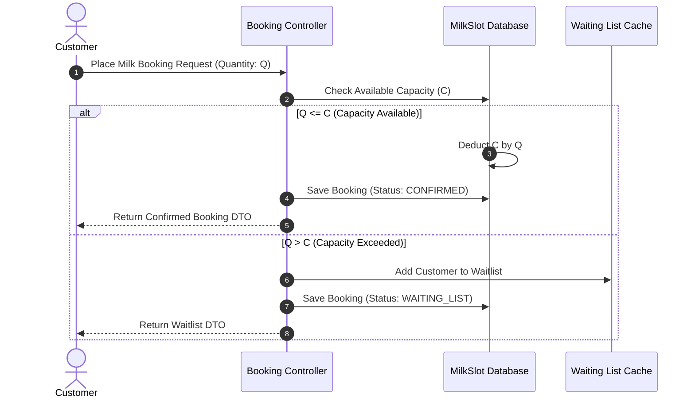
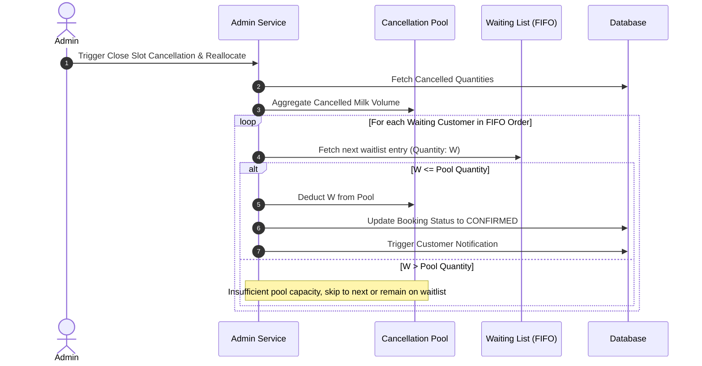
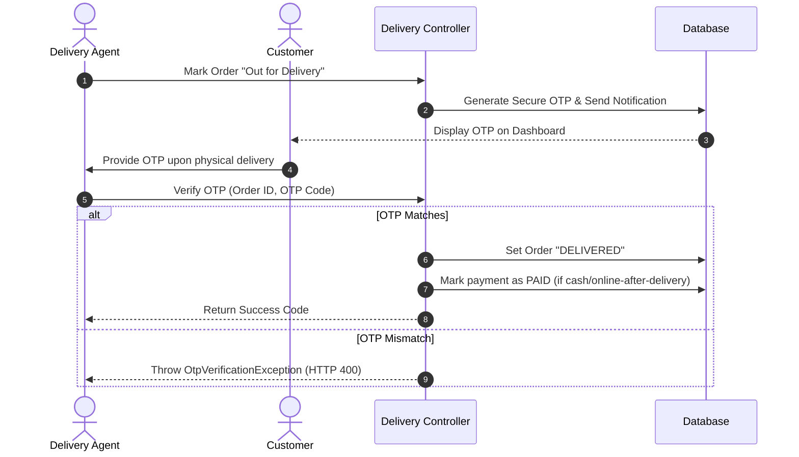

# 🥛 Daily Dairy — Premium Subscription & Inventory Backend System

A robust, enterprise-grade Spring Boot backend engine designed to power subscription-based daily milk delivery operations, dairy product inventory management, logistics routing, and business analytics. 

Built with modern software engineering practices, this backend incorporates role-based access control, transaction isolation, dynamic queue allocation, automated event-based notifications, and structured logging.

---

# 🌟 Key Features & Capabilities

### 1. Subscription Slot & Inventory Routing
* **Delivery Slots**: Define daily morning and evening delivery windows with rigid capacity limits.
* **Smart Booking Logic**: Bookings within open windows are instantly confirmed if quantity is available, or routed to a **Priority Waiting List** if capacity is breached.
* **Cancellation Allocation Pool**: Cancelled orders are returned to a localized resource pool and automatically allocated to the waiting list in FIFO order when the booking/cancellation window closes.

### 2. Micro-Logistics & Delivery Boys
* **Geographical Allocation**: Auto-assign deliveries to delivery agents based on customer PIN codes.
* **Secure Delivery Validation**: Double-handshake delivery completion using dynamically generated OTPs sent to the customer and verified by the delivery agent.

### 3. Financials, Analytics & Feedback
* **Hybrid Sales Ledger**: Integrated tracking of digital/subscription sales alongside offline walk-in storefront transactions.
* **Operating Expense Tracker**: Daily ledger for tracking costs (sourcing, logistics, salaries).
* **Analytics Engine**: Real-time aggregation of net profit margins, milk-loss tracking, and customer retention metrics.
* **Verified Reviews**: Unified feedback mechanism permitting only one review per delivered order.

### 4. Advanced Security & Access Controls (RBAC)
* State-of-the-art JWT-based authentication featuring three distinct roles: `ADMIN`, `CUSTOMER`, and `DELIVERY_BOY`.
* Strict database ownership verification filters preventing customers from accessing other customers' orders, addresses, or notification histories.

---

# 📐 Architecture & System Flows

### Order Confirmation and Waiting List Allocation Flow


## Cancellation and Pool Reallocation Flow


### Secure Delivery OTP Verification Flow


---

## 🛠️ Tech Stack & Architecture

* **Framework**: Spring Boot 3.5.14, Spring Web, Spring Security, Spring Data JPA
* **Database**: H2 (InMemory Testing & Local Development), Neon Serverless PostgreSQL (Production)
* **API Documentation**: OpenAPI / Swagger UI
* **Build System**: Maven 3.9+
* **Validation**: Hibernate Validator (Bean Validation API)
* **Testing**: JUnit 5, AssertJ, Mockito (Unit/Integration levels)

---

## 🚦 RESTful API Endpoint Catalog

All API endpoints are fully REST-compliant, mapping action-specific modifications to correct HTTP verbs (`GET`, `POST`, `PUT`, `PATCH`, `DELETE`).

### Authentication & Profiles
| Method | Endpoint | Access Role | Description |
| :--- | :--- | :--- | :--- |
| `POST` | `/api/auth/register` | `PUBLIC` | Register a new user account |
| `POST` | `/api/auth/login` | `PUBLIC` | Log in and receive a JWT token |

### Customer Operations
| Method | Endpoint | Access Role | Description |
| :--- | :--- | :--- | :--- |
| `POST` | `/api/customer/addresses` | `CUSTOMER` | Create delivery address |
| `GET` | `/api/customer/addresses/users/{userId}` | `CUSTOMER` | List all addresses for user |
| `PATCH` | `/api/customer/addresses/{addressId}/default` | `CUSTOMER` | Update default address selection |
| `POST` | `/api/customer/milk-bookings` | `CUSTOMER` | Book daily milk subscription slot |
| `DELETE`| `/api/customer/milk-bookings/{bookingId}` | `CUSTOMER` | Cancel milk booking within window |
| `GET` | `/api/customer/milk-bookings/users/{userId}` | `CUSTOMER` | Get paginated user milk booking history |
| `POST` | `/api/customer/milk-bookings/{bookingId}/payment` | `CUSTOMER` | Make payment for milk booking |
| `POST` | `/api/customer/products/orders` | `CUSTOMER` | Place one-time dairy product order |
| `GET` | `/api/customer/products/orders/users/{userId}`| `CUSTOMER` | View paginated product orders history |
| `POST` | `/api/customer/products/orders/{orderId}/payment` | `CUSTOMER` | Pay for product order |
| `POST` | `/api/customer/feedback` | `CUSTOMER` | Submit single review for a delivered order |
| `GET` | `/api/customer/notifications/users/{userId}` | `CUSTOMER` | Retrieve paginated notifications |
| `PATCH` | `/api/customer/notifications/{notificationId}/read` | `CUSTOMER` | Mark notification as read |
| `PATCH` | `/api/customer/notifications/users/{userId}/read-all`| `CUSTOMER` | Mark all notifications as read |

### Delivery Agent Operations
| Method | Endpoint | Access Role | Description |
| :--- | :--- | :--- | :--- |
| `POST` | `/api/delivery/assign-milk` | `DELIVERY_BOY` | Assign unassigned milk deliveries by PIN |
| `POST` | `/api/delivery/assign-products` | `DELIVERY_BOY` | Assign product orders by PIN |
| `GET` | `/api/delivery/track/type/{type}/id/{id}` | `DELIVERY_BOY` | Retrieve active tracking & OTP status |
| `PATCH` | `/api/delivery/{assignmentId}/out-for-delivery` | `DELIVERY_BOY` | Transition status and dispatch OTP |
| `PATCH` | `/api/delivery/{assignmentId}/delivered` | `DELIVERY_BOY` | Confirm delivery using OTP |

### Administration & Metrics
| Method | Endpoint | Access Role | Description |
| :--- | :--- | :--- | :--- |
| `POST` | `/api/admin/milk-slots` | `ADMIN` | Define a new milk delivery slot capacity |
| `PUT` | `/api/admin/milk-slots/{slotId}/quantity` | `ADMIN` | Update total quantity capacity for slot |
| `PATCH` | `/api/admin/milk-slots/{slotId}/close-booking` | `ADMIN` | Force close booking window for slot |
| `POST` | `/api/admin/milk-slots/{slotId}/close-cancellation-and-allocate`| `ADMIN` | Allocate cancelled pool to waitlist |
| `POST` | `/api/admin/products` | `ADMIN` | Create a new dairy product item |
| `PUT` | `/api/admin/products/{productId}/stock` | `ADMIN` | Set absolute stock quantity for product |
| `PATCH` | `/api/admin/products/{productId}/stock` | `ADMIN` | Increment/add stock for product |
| `PUT` | `/api/admin/products/{productId}/price` | `ADMIN` | Update base price of product |
| `PATCH` | `/api/admin/products/{productId}/activate` | `ADMIN` | Mark product item as active |
| `PATCH` | `/api/admin/products/{productId}/deactivate` | `ADMIN` | Hide product from customer catalog |
| `POST` | `/api/admin/business/offline-sales` | `ADMIN` | Record custom storefront walk-in sale |
| `POST` | `/api/admin/business/expenses` | `ADMIN` | Log daily operating expenses |
| `GET` | `/api/admin/business/analytics` | real-time | Compile revenue, profit, and loss report |

---

## ⚙️ Configuration & Environment Variables

This application utilizes a `.env` configuration file to separate credentials and database endpoints from source code.

Copy the environment example file:
```bash
cp .env.example .env
```

Define the following environment variables inside `.env`:
```ini
# Database configuration (Neon PostgreSQL production endpoint)
DB_URL=jdbc:postgresql://<neon-endpoint>/neondb?sslmode=require
DB_USERNAME=neondb_owner
DB_PASSWORD=<your-secure-neon-password>

# JWT Cryptographic Settings
JWT_SECRET=<your-super-secret-cryptographic-hash-key-at-least-256-bit>

# Application Port
PORT=8080
```

---

## 🚀 Getting Started

### 📋 Prerequisites
* Java JDK 21+ installed.
* Maven 3.9+ (or use the IntelliJ-bundled Maven cmd).
* Docker Desktop (for containerized execution).

### 🖥️ Local Run

1. **Verify Compilation & Test Execution**:
   Run the test runner using Maven:
   ```bash
   mvn clean test
   ```
   All 59 unit and integration tests should compile and pass successfully.

2. **Start Development Server**:
   Start the application locally using the default H2 database profile:
   ```bash
   mvn spring-boot:run
   ```
   The backend server will spin up on: `http://localhost:8080`

3. **Explore Documentation**:
   Access Swagger UI to view the live OpenAPI interactive document:
   * **Swagger Endpoint**: `http://localhost:8080/swagger-ui/index.html`
   * **H2 Database Console**: `http://localhost:8080/h2-console` (JDBC URL: `jdbc:h2:mem:dairydb`)

---

## 🐳 Containerization & Deployment

To deploy using containerized Docker infrastructure:

### 1. Build the Docker Image
```bash
docker build -t daily-dairy-backend:latest .
```

### 2. Launch Stack via Docker Compose
Use Docker Compose to deploy the backend service along with network bounds defined in `docker-compose.yml`:
```bash
docker-compose up -d
```

---

## 🧪 Testing Coverage

The codebase includes **59 robust test cases** representing:
1. **Unit Tests (Service Layer Mocking)**: Covers exceptions propagation, validation boundary errors, logic path routing, and transactional dependencies.
2. **Integration Tests (Contextual Integration)**: Validates end-to-end booking transactions, cancellation allocations, database updates, and authentication/ownership filters.
